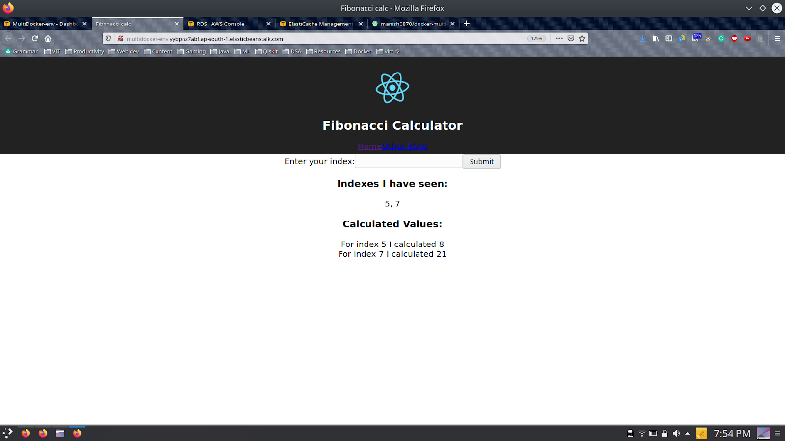

# Docker microserviced webserver
My first project using virtulization / containerization tool namely docker :whale: , which helped me to inturn understand microservice architecture used in deployment environments, one of which, AWS Elasticbeanstalk is used here.

## Application Architecture

### Working
Initially the project is made, developed and tested in a local environment. For this initially Docker was installed on the local machine. Then the required amount of containers were defined and configured based on the mapped system architecture.

The web app's basic work is to calculate the Fibonacci series number for the given index value of the sequence. The work of the Nginx container is to route the incoming traffic to either the React Server or the Express Server depending on the request made by the application. The work of the React server is to serve with the front end of the react app (all the components, css, etc). While the Express server deals with the backend work.

The backend of the app consists of three components: 
 - Redis database: Redis stores the calculated value of fibonacci along with the indexes and prevents multiple calculation for the same indices, so works as a dictionary.
 - PostgreSQL: This is used to permanently store the input values by the user and display it.
 - Worker module: The responsibility of the worker is to monitor the redis database for new requests and if found calculate fibonacci for the input.

We now know the basic working of the web app on how it is calculating the fibonacci index value. We shall now discuss its deployment phase. These are the steps we will follow to deploy our website, distributed in microservices of docker based containers onto Amazon web services.

For this project we are going to use CI pipelining to make sure that the latest version of the software is available for the users. We will be using TravisCI in particular to become a link between our Github repository and the AWS Elastic Beanstalk (used to deploy web applications). 

Travis CI is configured by adding a file named .travis.yml, which is a YAML format text file, to the root directory of the repository. This file specifies the programming language used, the desired building and testing environment (including dependencies which must be installed before the software can be built and tested), and various other parameters. 

And if the tests conducted by travis exits with code 0, it pushes the project onto AWS EB (Elastic beanstalk). Moving forward, EB pulls the images from Docker Hub and deploys them on the cloud.

## AWS Architecture

## AWS Deployment

## Final Website Hosted on AWS

 
